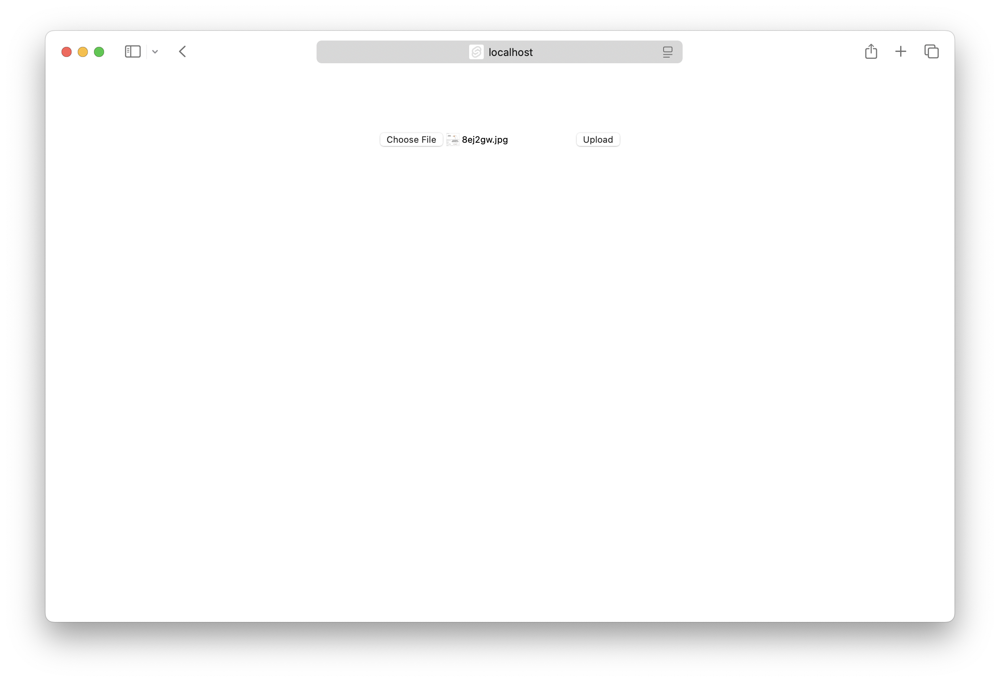

There are two ways to deploy a SvelteKit app to AWS with SST.

1. [Serverless](#serverless)
2. [Containers](#containers)

We'll use both to build a couple of simple apps below.

---

#### Examples

We also have a few other SvelteKit examples that you can refer to.

- [Hit counter with Redis and SvelteKit in a container](/docs/examples/#aws-sveltekit-container-with-redis)

---

## Serverless

We are going to create a SvelteKit app, add an S3 Bucket for file uploads, and deploy it using the `SvelteKit` component.

:::tip[View source]
You can [view the source](https://github.com/sst/sst/tree/dev/examples/aws-svelte-kit) of this example in our repo.
:::

Before you get started, make sure to [configure your AWS credentials](/docs/iam-credentials#credentials).

---

### 1. Create a project

Let's start by creating our app.

```bash
npx sv create aws-svelte-kit
cd aws-svelte-kit
```

We are picking the **_SvelteKit minimal_** and **_Yes, using TypeScript syntax_** options.

---

##### Init SST

Now let's initialize SST in our app.

```bash
npx sst@latest init
npm install
```

Select the defaults and pick **AWS**. This'll create a `sst.config.ts` file in your project root.

It'll also ask you to update your `svelte.config.mjs` with something like this.

```diff lang="js" title="svelte.config.mjs"
- import adapter from '@sveltejs/adapter-auto';
+ import adapter from "svelte-kit-sst";
```

---

##### Start dev mode

Run the following to start dev mode. This'll start SST and your SvelteKit app.

```bash
npx sst dev
```

Once complete, click on **MyWeb** in the sidebar and open your SvelteKit app in your browser.

---

### 2. Add an S3 Bucket

Let's allow public `access` to our S3 Bucket for file uploads. Update your `sst.config.ts`.

```js title="sst.config.ts"
const bucket = new sst.aws.Bucket("MyBucket", {
  access: "public"
});
```

Add this above the `SvelteKit` component.

##### Link the bucket

Now, link the bucket to our SvelteKit app.

```js title="sst.config.ts" {2}
new sst.aws.SvelteKit("MyWeb", {
  link: [bucket]
});
```

---

### 3. Create an upload form

Let's add a file upload form. Replace your `src/routes/+page.svelte`. This will upload a file to a given pre-signed upload URL.

```svelte title="src/routes/+page.svelte"
<script>
  /** @type {import('./$types').PageData} */
  export let data;

  const handleSubmit = async (e) => {
    const formData = new FormData(e.target);
    const file = formData.get("file");

    const image = await fetch(data.url, {
      body: file,
      method: "PUT",
      headers: {
        "Content-Type": file.type,
        "Content-Disposition": `attachment; filename="${file.name}"`,
      },
    });

    window.location.href = image.url.split("?")[0];
  };
</script>

<section>
  <form on:submit|preventDefault={handleSubmit}>
    <input name="file" type="file" accept="image/png, image/jpeg" />
    <button type="submit">Upload</button>
  </form>
</section>
```

Add some styles.

```css title="src/routes/+page.svelte"
<style>
  section {
    flex: 0.6;
    display: flex;
    padding-top: 4rem;
    align-items: center;
    flex-direction: column;
    justify-content: center;
  }
</style>
```

---

### 4. Generate a pre-signed URL

When our route loads, we'll generate a pre-signed URL for S3 and our form will upload to it. Create a new `src/routes/+page.server.ts` and add the following.

```ts title="src/routes/+page.server.ts" {5}
/** @type {import('./$types').PageServerLoad} */
export async function load() {
  const command = new PutObjectCommand({
    Key: crypto.randomUUID(),
    Bucket: Resource.MyBucket.name,
  });
  const url = await getSignedUrl(new S3Client({}), command);

  return { url };
}
```

:::tip
We are directly accessing our S3 bucket with `Resource.MyBucket.name`.
:::

Add the relevant imports.

```ts title="src/routes/+page.server.ts"
import { Resource } from "sst";
import { getSignedUrl } from "@aws-sdk/s3-request-presigner";
import { S3Client, PutObjectCommand } from "@aws-sdk/client-s3";

```

And install the npm packages.

```bash
npm install @aws-sdk/client-s3 @aws-sdk/s3-request-presigner
```

Head over to the local SvelteKit app in your browser, `http://localhost:5173` and try **uploading an image**. You should see it upload and then download the image.


---

### 5. Deploy your app

Now let's deploy your app to AWS.

```bash
npx sst deploy --stage production
```

You can use any stage name here but it's good to create a new stage for production.

Congrats! Your app should now be live!

---

## Containers

We are going to create a SvelteKit app, add an S3 Bucket for file uploads, and deploy it in a container with the `Cluster` component.

:::tip[View source]
You can [view the source](https://github.com/sst/sst/tree/dev/examples/aws-svelte-container) of this example in our repo.
:::

Before you get started, make sure to [configure your AWS credentials](/docs/iam-credentials#credentials).

---

### 1. Create a project

Let's start by creating our project.

```bash
npx sv create aws-svelte-container
cd aws-svelte-container
```

We are picking the **_SvelteKit minimal_** and **_Yes, using TypeScript syntax_** options.

---

##### Init SST

Now let's initialize SST in our app.

```bash
npx sst@latest init
npm install
```

Select the defaults and pick **AWS**. This'll create a `sst.config.ts` file in your project root.

It'll also ask you to update your `svelte.config.mjs`. But **we'll instead use** the [Node.js adapter](https://kit.svelte.dev/docs/adapter-node) since we're deploying it through a container.

```bash
npm i -D @sveltejs/adapter-node
```

And updating your `svelte.config.js`.

```diff lang="js" title="svelte.config.mjs"
- import adapter from '@sveltejs/adapter-auto';
+ import adapter from '@sveltejs/adapter-node';
```

---

### 2. Add a Service

To deploy our SvelteKit app in a container, we'll use [AWS Fargate](https://aws.amazon.com/fargate/) with [Amazon ECS](https://aws.amazon.com/ecs/). Replace the `run` function in your `sst.config.ts`.

```js title="sst.config.ts" {10-12}
async run() {
  const vpc = new sst.aws.Vpc("MyVpc");
  const cluster = new sst.aws.Cluster("MyCluster", { vpc });

  new sst.aws.Service("MyService", {
    cluster,
    loadBalancer: {
      ports: [{ listen: "80/http", forward: "3000/http" }],
    },
    dev: {
      command: "npm run dev",
    },
  });
}
```

This creates a VPC, and an ECS Cluster with a Fargate service in it.

:::note
By default, your service in not deployed when running in _dev_.
:::

The `dev.command` tells SST to instead run our SvelteKit app locally in dev mode.

---

#### Start dev mode

Run the following to start dev mode. This'll start SST and your SvelteKit app.

```bash
npx sst dev
```

Once complete, click on **MyService** in the sidebar and open your SvelteKit app in your browser.

---

### 3. Add an S3 Bucket

Let's allow public `access` to our S3 Bucket for file uploads. Update your `sst.config.ts`.

```ts title="sst.config.ts"
const bucket = new sst.aws.Bucket("MyBucket", {
  access: "public"
});
```

Add this below the `Vpc` component.

---

##### Link the bucket

Now, link the bucket to the container.

```ts title="sst.config.ts" {3}
new sst.aws.Service("MyService", {
  // ...
  link: [bucket],
});
```

This will allow us to reference the bucket in our SvelteKit app.

---

### 4. Create an upload form

Let's add a file upload form. Replace your `src/routes/+page.svelte`. This will upload a file to a given pre-signed upload URL.

```svelte title="src/routes/+page.svelte"
<script>
  /** @type {import('./$types').PageData} */
  export let data;

  const handleSubmit = async (e) => {
    const formData = new FormData(e.target);
    const file = formData.get("file");

    const image = await fetch(data.url, {
      body: file,
      method: "PUT",
      headers: {
        "Content-Type": file.type,
        "Content-Disposition": `attachment; filename="${file.name}"`,
      },
    });

    window.location.href = image.url.split("?")[0];
  };
</script>

<section>
  <form on:submit|preventDefault={handleSubmit}>
    <input name="file" type="file" accept="image/png, image/jpeg" />
    <button type="submit">Upload</button>
  </form>
</section>
```

Add some styles.

```css title="src/routes/+page.svelte"
<style>
  section {
    flex: 0.6;
    display: flex;
    padding-top: 4rem;
    align-items: center;
    flex-direction: column;
    justify-content: center;
  }
</style>
```

---

### 5. Generate a pre-signed URL

When our route loads, we'll generate a pre-signed URL for S3 and our form will upload to it. Create a new `src/routes/+page.server.ts` and add the following.

```ts title="src/routes/+page.server.ts" {5}
/** @type {import('./$types').PageServerLoad} */
export async function load() {
  const command = new PutObjectCommand({
    Key: crypto.randomUUID(),
    Bucket: Resource.MyBucket.name,
  });
  const url = await getSignedUrl(new S3Client({}), command);

  return { url };
}
```

:::tip
We are directly accessing our S3 bucket with `Resource.MyBucket.name`.
:::

Add the relevant imports.

```ts title="src/routes/+page.server.ts"
import { Resource } from "sst";
import { getSignedUrl } from "@aws-sdk/s3-request-presigner";
import { S3Client, PutObjectCommand } from "@aws-sdk/client-s3";

```

And install the npm packages.

```bash
npm install @aws-sdk/client-s3 @aws-sdk/s3-request-presigner
```

Head over to the local SvelteKit app in your browser, `http://localhost:5173` and try **uploading an image**. You should see it upload and then download the image.



---

### 6. Deploy your app

To deploy our app we'll add a `Dockerfile`.

```diff lang="dockerfile" title="Dockerfile"
FROM node:18.18.0-alpine AS builder

WORKDIR /app
COPY package*.json .
RUN npm install
COPY . .
RUN npm run build
RUN npm prune --prod

FROM builder AS deployer

WORKDIR /app
COPY --from=builder /app/build build/
COPY --from=builder /app/package.json .
EXPOSE 3000
ENV NODE_ENV=production
CMD [ "node", "build" ]
```

This builds our SvelteKit app in a Docker image.

:::tip
You need to be running [Docker Desktop](https://www.docker.com/products/docker-desktop/) to deploy your app.
:::

Let's also add a `.dockerignore` file in the root.

```bash title=".dockerignore"
.DS_Store
node_modules
```

Now to build our Docker image and deploy we run:

```bash
npx sst deploy --stage production
```

You can use any stage name here but it's good to create a new stage for production.

Congrats! Your app should now be live!

---

## Connect the console

As a next step, you can setup the [SST Console](/docs/console/) to _**git push to deploy**_ your app and view logs from it.


You can [create a free account](https://console.sst.dev) and connect it to your AWS account.
